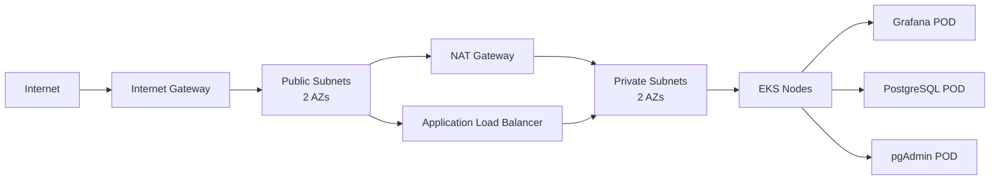

# EKS Deployment with Grafana, PostgreSQL, and pgAdmin

Production-ready EKS cluster deployment with Grafana (Azure AD SSO), PostgreSQL database, and pgAdmin management interface using AWS CloudFormation and Kubernetes.

## Architecture

- **EKS Cluster**: Kubernetes 1.34 with Bottlerocket nodes
- **Networking**: VPC with public/private subnets across 2 AZs
- **Storage**: EFS for persistent data (Grafana & PostgreSQL)
- **Security**: AWS Secrets Manager with CSI driver, KMS encryption
- **Ingress**: AWS ALB with SSL/TLS termination
- **Autoscaling**: Cluster Autoscaler for node scaling

## Prerequisites

- AWS CLI configured with appropriate credentials
- kubectl installed
- eksctl installed
- helm installed
- AWS account with permissions for EKS, VPC, IAM, Secrets Manager

## Quick Start

### 1. Deploy EKS Infrastructure

```bash
make deploy-eks
```

This creates:

- VPC with public/private subnets
- EKS cluster with managed node group
- IAM roles and policies
- EFS file system
- Secrets in AWS Secrets Manager

### 2. Install Required Drivers

```bash
make install-drivers
```

Installs:

- AWS Load Balancer Controller
- Cluster Autoscaler
- Secrets Store CSI Driver

### 3. Deploy Applications

```bash
make deploy-k8s
```

Deploys:

- PostgreSQL database
- Grafana with Azure AD SSO
- pgAdmin interface (disabled by default)

### Full Deployment (All Steps)

```bash
make deploy
```

## Configuration

### Makefile Variables

Override defaults by setting environment variables:

```bash
STACK_NAME=my-stack AWS_REGION=us-east-1 make deploy-eks
```

| Variable | Default | Description |
| ---------- | --------- | ------------- |
| STACK_NAME | grafana-eks | CloudFormation stack name |
| AWS_REGION | eu-central-1 | AWS region |
| AWS_PROFILE | ecs-test | AWS CLI profile |
| PARAMETERS_FILE | parameters.json | CloudFormation parameters file |

### CloudFormation Parameters

Parameters are organized into logical groups for better readability:

#### Network & Security Configuration

- **CertificateArn**: ACM certificate ARN for HTTPS (must be valid ACM ARN format)
- **GrafanaDomainName**: Domain for Grafana access (must be valid FQDN)
- **PublicRouteCidr**: CIDR for public internet access (default: 0.0.0.0/0)

#### Azure AD Integration

- **AzureClientId**: Azure AD application client ID (UUID format)
- **AzureClientSecret**: Azure AD application secret
- **AzureTenantId**: Azure AD tenant ID (UUID format)

#### Application Credentials

- **GrafanaAdminPassword**: Grafana admin password (8-128 chars)
- **PostgresAdminPassword**: PostgreSQL admin password (8-128 chars)
- **PgAdminEmail**: pgAdmin login email (valid email format)
- **PgAdminPassword**: pgAdmin password (8-128 chars)

#### Infrastructure Configuration

- **StorageType**: Storage backend (EBS or EFS, default: EFS)
- **AutoscalerType**: Autoscaler type (default: ClusterAutoscaler)

#### Resource Tagging

- **TagProject**: Project tag value
- **TagOwner**: Owner tag value (email recommended)

## Components

### EKS Cluster

- **Version**: 1.34
- **Node Type**: t3.medium (Bottlerocket)
- **Scaling**: 1-5 nodes (auto-scaling enabled)
- **Addons**: EBS CSI, EFS CSI, VPC CNI, CoreDNS, Pod Identity Agent, Metrics Server
- **Authentication**: API_AND_CONFIG_MAP mode (supports both EKS Access Entries and aws-auth ConfigMap)

### Grafana

- **Image**: grafana/grafana:latest
- **Authentication**: Azure AD SSO + local admin
- **Storage**: EFS-backed persistent volume (5Gi)
- **Access**: HTTPS via ALB
- **Plugins**: grafana-piechart-panel

### PostgreSQL

- **Image**: postgres:17.6
- **Database**: amazon_connect
- **User**: admin
- **Storage**: EFS-backed persistent volume (5Gi)
- **Port**: 5432 (internal only)

### pgAdmin

- **Image**: dpage/pgadmin4:latest
- **Access**: HTTPS via ALB (port 8080)
- **Status**: Disabled by default (manifests available as .disabled files)

## Security

### Secrets Management

All secrets stored in AWS Secrets Manager:

- Grafana admin password
- Azure AD credentials
- PostgreSQL password
- pgAdmin credentials

Secrets mounted via CSI driver (no environment variables).

### Encryption

- **EKS secrets**: Encrypted with KMS
- **EFS**: Encrypted at rest
- **Secrets Manager**: KMS encrypted
- **Traffic**: TLS/SSL via ALB

### IAM

- IRSA (IAM Roles for Service Accounts) for pod-level permissions
- Least privilege access policies
- Pod Identity for EKS addons

## Management Commands

### Status & Information

```bash
make status          # Check stack status
make outputs         # View stack outputs
```

### Updates

```bash
make update-eks      # Update EKS stack
make update-k8s      # Update Kubernetes manifests with prune (removes disabled resources)
```

### Cleanup

```bash
make delete-k8s      # Delete Kubernetes resources
make delete-drivers  # Remove drivers and controllers
make delete-eks      # Delete CloudFormation stack
make clean           # Full cleanup (all above)
```

### Manifest Management

```bash
make update-k8s      # Update manifests with prune (removes disabled components)
```

The `update-k8s` target uses `kubectl apply --prune` to automatically remove resources that are disabled (e.g., pgAdmin components with .disabled extension).

## Accessing Applications

After deployment:

```bash
# Get Grafana URL
kubectl get ingress grafana -n grafana-stack

# Get pgAdmin URL
kubectl get ingress pgadmin -n pgadmin-stack
```

### Grafana Login

- **URL**: https://[your-domain]
- **Username**: admin
- **Password**: From AWS Secrets Manager (GrafanaAdminPasswordSecret)
- **SSO**: Azure AD authentication enabled

### pgAdmin Login (if enabled)

- **URL**: https://[your-domain]:8080
- **Email**: From AWS Secrets Manager (PgAdminEmailSecret)
- **Password**: From AWS Secrets Manager (PgAdminPasswordSecret)
- **Note**: pgAdmin is disabled by default. To enable, rename .disabled files in k8s-manifests/ and run `make update-k8s`

## Troubleshooting

### Check pod status

```bash
kubectl get pods -n grafana-stack
kubectl get pods -n postgres-stack
kubectl get pods -n pgadmin-stack
```

### View logs

```bash
kubectl logs -n grafana-stack deployment/grafana
kubectl logs -n postgres-stack deployment/postgres
kubectl logs -n pgadmin-stack deployment/pgadmin
```

### Verify secrets mounting

```bash
kubectl exec -n grafana-stack deployment/grafana -- ls -la /mnt/secrets-store
```

### Check ALB status

```bash
kubectl describe ingress grafana -n grafana-stack
```

## Cost Optimization

- **Node Type**: t3.medium (adjust based on workload)
- **Scaling**: Min 1, Max 3 nodes (tune as needed)
- **EFS**: Provisioned only when needed
- **NAT Gateway**: Single NAT in one AZ (add more for HA)

## Network Architecture



## File Structure

```plaintext
.
├── .gitignore                          # Git ignore rules
├── Makefile                            # Deployment automation
├── grafana-eks.yaml                    # CloudFormation template
├── parameters.json                     # CloudFormation parameters file
├── chittora-access.yaml               # EKS Access Entry for restricted users
├── eks-admin-role.yaml                # Dedicated EKS admin role
└── k8s-manifests/                      # Kubernetes manifests directory
    ├── 01-namespaces.yaml             # Namespace definitions
    ├── 02-secrets-provider-class.yaml # Secrets Store CSI configuration
    ├── 03-service-accounts.yaml       # Service accounts with IRSA
    ├── 04-storage-class.yaml          # EFS storage class
    ├── 05-postgres-pvc.yaml           # PostgreSQL persistent volume
    ├── 06-grafana-pvc.yaml            # Grafana persistent volume
    ├── 07-postgres-deployment.yaml    # PostgreSQL deployment
    ├── 08-postgres-service.yaml       # PostgreSQL service
    ├── 09-grafana-deployment.yaml     # Grafana deployment
    ├── 10-grafana-ingress.yaml        # Grafana ALB ingress
    ├── 11-pgadmin-deployment.yaml.disabled  # pgAdmin deployment (disabled)
    ├── 12-pgadmin-service.yaml.disabled     # pgAdmin service (disabled)
    └── 13-pgadmin-ingress.yaml.disabled     # pgAdmin ingress (disabled)
```

## License

Internal use only.
